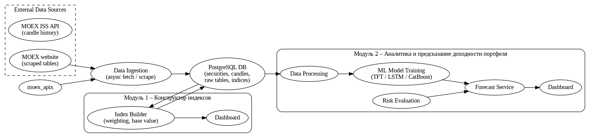

# Funding Assistant

## Архитектура проекта

Проект состоит из двух модулей:

1. Конструктор фондовых индексов российских ценных бумаг
2. Аналитика и прогноз доходности финансового портфеля

Проект представлен в формате web-сервиса. Для реализации серверной части используется FastAPI, интерфейс реализован с помощью библиотеки Streamlit.

## Структура проекта

Описание функциональности проекта будет добавлено позднее.

## Запуск

1. Установите необходимые зависимости из файла `requirements.txt`
2. Из корня проекта запустите интерфейс с помощью команды `streamlit run streamlit_app.py`
3. Для запуска бэкенд-части выполните команды `cd app;  uvicorn main:app --reload`