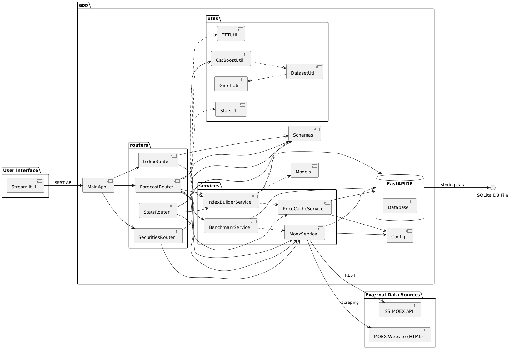

# Funding Assistant

**Funding Assistant** — веб-сервис для  
1. **построения пользовательских фондовых индексов** на базе российских ценных бумаг,  
2. **анализа и прогнозирования доходности портфеля** с использованием моделей машинного обучения (GARCH + CatBoost и Temporal Fusion Transformer).

---

## Ключевые возможности

- **Конструктор индексов**  
  - Сбор и кэширование цен закрытия через MOEX ISS-API и парсинг сайта  
  - Расчёт пользовательских индексов и портфелей с разными весовыми схемами  
- **Аналитика и прогнозирование**  
  - Модель GARCH для оценки волатильности и базового прогноза + CatBoost для уточнения прогноза
  - CatBoost для оценки вероятности доходности  
  - Temporal Fusion Transformer для предсказания ценовых рядов  
  - Расчёт исторических показателей  
- **Веб-интерфейсы**  
  - **FastAPI**: REST-API для получения данных, управления индексами и запуска прогнозов  
  - **Streamlit**: интерактивный фронтенд для визуализации результатов  

---

## Архитектура

  

1. **app/**  
   - **routers/** — контроллеры (эндпоинты):  
     - `forecast.py` — прогнозирование и статистика  
     - `index.py` — CRUD-операции с пользовательскими индексами  
     - `securities.py` — список доступных ценных бумаг MOEX  
   - **services/** — бизнес-логика и интеграции:  
     - `moex.py` — получение цен и метаданных через ISS-API и веб-скрейпинг  
     - `price_cache.py` — кеширование ежедневных цен  
     - `benchmark.py` — загрузка стандартного индекса MOEX  
     - `index_builder.py` — вычисление кастомных индексов и портфелей  
   - **utils/** — ML-утилиты:  
     - `garch.py`, `catboost.py`, `tft.py` — обучение и инференс моделей  
     - `dataset.py` — подготовка датасетов для CatBoost  
   - `config.py` — параметры подключения к БД и константы  
   - `database.py` — инициализация БД (SQLite / SQLModel)  
   - `models.py` — ORM-модели таблиц  
   - `schemas.py` — Pydantic-схемы запросов/ответов  
   - `main.py` — точка старта FastAPI  
2. **streamlit_app.py** — клиентская часть на Streamlit, использующая REST-API  
3. **db.sqlite3** — встроенная СУБД для хранения индексов и кеша цен  

---

## Предварительные требования

Сервис был написан с использованием Python 3.12.

---

## Установка и запуск

```bash
# 1. Клонируем репозиторий
git clone https://github.com/DannyTheFlower/funding-assistant.git
cd funding-assistant

# 2. Создаем и активируем виртуальное окружение
python -m venv .venv
source .venv/bin/activate       # Linux/macOS
.\.venv\Scripts\activate        # Windows

# 3. Устанавливаем зависимости
pip install --upgrade pip
pip install -r requirements.txt

# 4. Запускаем FastAPI-сервер
cd app
uvicorn main:app --reload --host 0.0.0.0 --port 8000

# 5. (В новом терминале) Запускаем UI на Streamlit
cd ..
streamlit run streamlit_app.py
